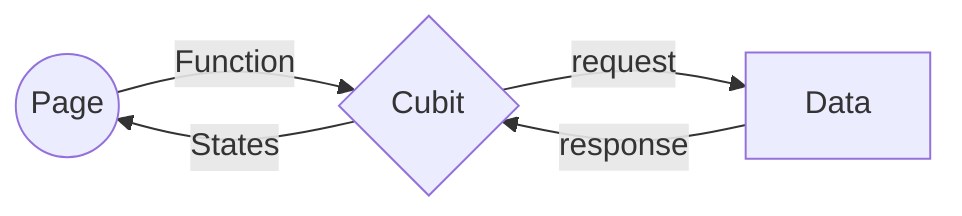

# flutter_template_rxdart

A new Flutter project.

## Use build runner to automaticly generating: assets, injection, freezed and json_serializable

```bash
flutter pub run build_runner watch --delete-conflicting-outputs
flutter pub run build_runner build --delete-conflicting-outputs
```

### Example injection

```dart
@lazySingleton
class A{
    const A();
}
```

# Auto route + BLoC

## Introduction

Bloc:

- Quản lý tất cả trạng thái của widget trong ứng dụng

Auto route:

- Đơn giản hoá việc điều hướng trong ứng dụng

# Usage

## 1. Thêm annotation @RoutePage

```
@RoutePage()
class LoginPage extends StatefulWidget {
...
}
```

## 2. Triển khai wrap widget bằng BlocProvider

```
@RoutePage()
class LoginPage extends StatefulWidget implements AutoRouteWrapper {
...
	@override
	Widget wrappedRoute(BuildContext context) {
		return BlocProvider(
			create: (context) => LoginBloc(),
			child: this,
		);
	}
}
```

## 3. Chọn loại Bloc

Tuỳ vào mục đích sử dụng và tính năng của mỗi loại Bloc để chọn ra loại phù hợp với màn hình hiện tại.
Đọc thêm (https://pub.dev/packages/flutter_bloc)

Ví dụ:

```
// Bổ sung sau
```

## 4. Flow chart


# flutter_template
